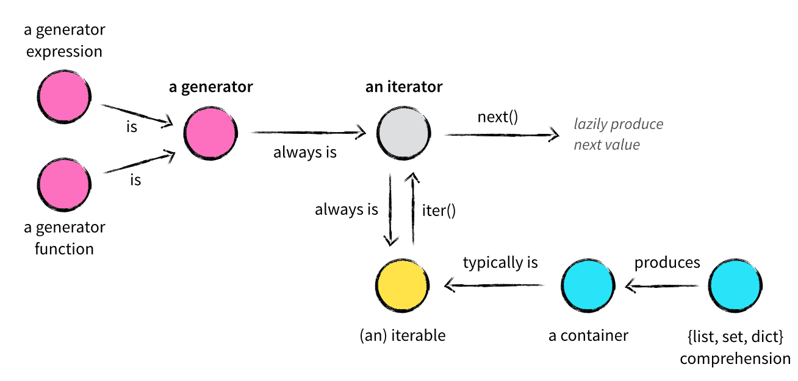

# bb-python-iter

이터레이터와 제너레이터의 차이는 한꺼번에 메모리에 올리냐, 아니냐는 차이가 있다고 한다. 그런데, 나는 아닌것 같다.
이터레이터는 `list`로 묶어서 한번에 반환하게 해두고, 제너레이터는 `next()` 를 사용해서 하나만 반환하게 해두고 그러한 설명을 적어두었다. 나는 그런 방법이라면 똑같이 이터레이터를 만들 수 있다고 생각했다. 왜냐하면 제너레이터는 이터레이터 클래스로 만들 수 있기 때문이다.

## 리서치 지식
iterable - iterator - generator 순서로 상속이 된다고 한다.

아래의 그림은 큰 도움이 되었다.

* list, tuple, set은 컨테이너이고, iterable를 상속받지만 iterator를 상속받진 않았다. 

## 결만
결국은 이렇다. 나는 이터레이터와 제너레이터를 잘 알지 못하는 와중에, 공부하다가 조금 핀트가 엇나간 글을 보고 더 착각에 빠졌었다. 원문에서는 문맥상 리스트와 제너레이터를 비교했을 것이다.

결국 어디에도 정확한 차이를 기술한 곳을 찾지 못했다(지쳤다). 그저 제너레이터를 설명하는 과정에서 상위 클래스 (부모)인 이터레이터를 소개하고, 그 이터레이터 중 특수한 형태의 이터레이터인 제너레이터 (세련된)의 장점을 소개했다. 유의미한 차이가 분명히 있을 것이라고 가정해놓고 찾았지만, 딱히 그런점은 없었다.

내가 정리한 차이 역시 답답하다. 면접에서 물어보는 이유 뒤에 어떤 정답이 기다리고 있을까 궁금하다(내 목적). 내가 내린 결론은, 거의 같다. 그렇지만 좀 더 세련되게 이터레이터를 작성하고 싶다면 제너레이터를 활용하는게 맞겠다.

* 이터레이터는 클래스를 이용해 작성하도록 되어있다.
* 제너레이터는 함수를 이용해 작성한다.
* 둘다 `__next__()`와 `__iter__()`가 구현되어 있어야 한다.
* 제너레이터는 함수처럼 쓰지만 두개의 매직 함수(더블언더로 쌓여진 함수)가 자동 생성된다.
* 제너레이터는 이터레이터를 상속하고 있다.
* 이터레이터는 iter와 클래스 작성법을 이용해 작성가능하다
* 제너레이터는 yield와 제너레이터 표현식을 이용해 작성가능하다.

## 그외 시도해볼 것들
* Iterator 클래스의 `__abstractmethods__` 속성을 출력해서 어떤것이 꼭 구현되어있어야 하는지를 파악 한 블로그가 있었다.
  * https://engineer-mole.tistory.com/64
* 제너레이터 yield는 값을 내보내기도 하지만 받아서 사용할 수 도 있다.
* yield from 이라는 키워드도 있다.
